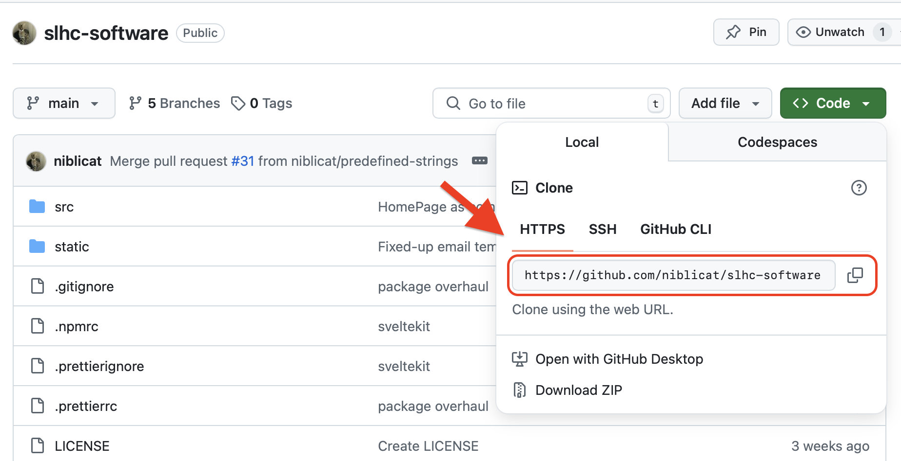
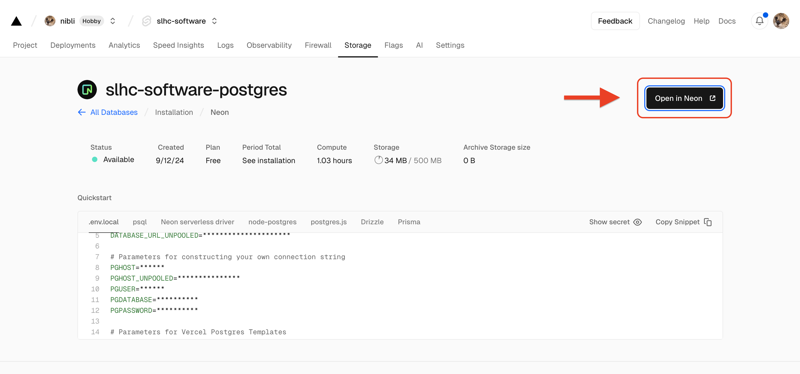
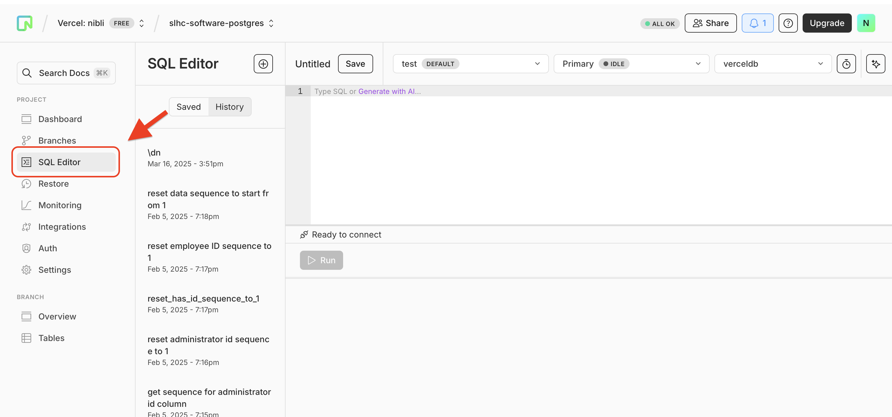
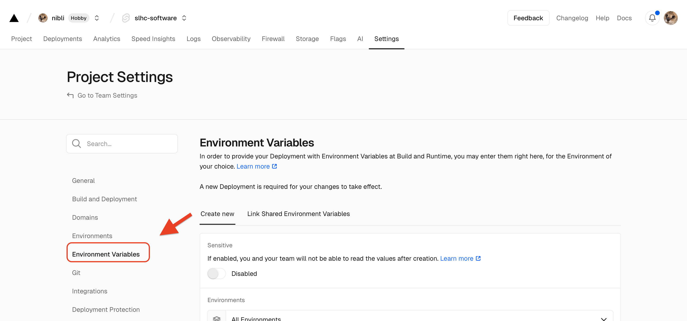
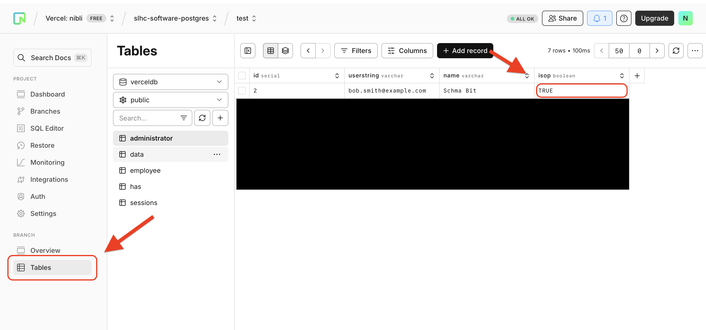

# Hearing Degredation Manager
Manage employee hearing data and communicate changes to employees!

**Table of contents**
1. [Limitations](#limitations)
2. [Requirements to Deploy](#requirements-to-deploy)
3. [Setting up Your Project](#setting-up-your-project)
    1. [Repository Setup](#repository-setup)
    2. [Vercel Setup](#vercel-setup)
    3. [OAuth Setup](#oauth-setup)
    4. [Finishing Touches](#finishing-touches)
4. [Simple Website Modification](#simple-website-modification)
    1. [Public Homepage](#public-homepage)
    2. [Dashboard Homepage](#dashboard-homepage)
    3. [Favicon](#favicon)
    4. [Authentication Providers](#authentication-providers)
5. [Running Locally](#running-locally)
    1. [Setup](#setup)
    2. [Environment Variables](#environment-variables)
    3. [Locally Run](#locally-run)

## Limitations
- Only allows for yearly hearing screenings (multiple screenings in the same year is not possible).

## Requirements to Deploy
- Git CLI or GitHub Desktop
- Repository service (i.e. GitHub or GitLab) for [CI/CD](https://en.wikipedia.org/wiki/CI/CD)
- Vercel account

## Setting Up Your Project
This will describe how to set up a new hearing degredation manager from scratch.

### Repository Setup
First, we will create a new repository from this one for your own version of the portal. With GitHub, we can [import a repository](https://docs.github.com/en/migrations/importing-source-code/using-github-importer/about-github-importer).

The URL for the source repository is `https://github.com/niblicat/slhc-software.git`. You should not require credentials to import it. Name it whatever you wish. Once you are done, copy your new repository's HTTPS web URL. You can find it after clicking "Code" on your repository's main page.


In the command line/terminal, you should now clone your new repository using your new repository's link.
```git
git remote set-url origin {YOUR NEW REPOSITORY'S LINK}
```

### Vercel Setup
If you do not have a Vercel account already, I recommend that you create one using the repository service account that you're using for this project for easy project linking.

[Add a new Vercel project using your Git repository](https://vercel.com/docs/git).
Navigate to the 'Storage' tab. [Add a Postgres database to your Vercel project](https://vercel.com/docs/postgres). We used Neon.

Once it has been created, click 'Open in Neon' in the 'Storage' tab.


In Neon, navigate to the SQL Editor. Here, copy and paste the contents of [the Postgres table setup file](readme-resources/postgres-setup.sql).


### OAuth Setup
Note that you only need one authentication method to use this project, but you will still see both login with Google and Github buttons unless you configure your project otherwise (see the [Simple Website Modification](#simple-website-modification) section to change that or to learn how to add other authenticaton providers).

#### Authorization Secret
You need an authorization secret. View the [Auth.js guide](https://authjs.dev/guides/environment-variables#auth-secret) on how to generate one (you will need [NPM](https://nodejs.org/en/download/)). Alternatively, you can [generate one online](https://auth-secret-gen.vercel.app), but it's not recommended. Make sure to record the value that is generated for later.

#### Authorization Platforms
On the project tab of Vercel, you can find your project's deployment domain. If you have your own domain that you want to use, you can set it up in Vercel's settings. This will be important for setting up authentication. Let's assume your website is `https://example.vercel.app` for the following steps.

##### GitHub Authentication
For GitHub authentication, [follow GitHub's "Creating an OAuth app" guide](https://docs.github.com/en/apps/oauth-apps/building-oauth-apps/creating-an-oauth-app).
- **Homepage URL**: `https://example.vercel.app`
- **Authorization Callback URL**: `https://example.vercel.app/auth/callback/github`

Make sure to record the following:
- Client ID
- Client Secret (it should allow you to generate a secret)

##### Google Authentication
For Google authentication, [follow Google's "Using OAuth 2.0 to Access Google APIs" guide](https://developers.google.com/identity/protocols/oauth2).
- **Authorized Javascript Origin**: `https://example.vercel.app`
- **Authorized redirect URI**: `https://example.vercel.app/auth/callback/google`

Make sure to record the following:
- Client ID
- Client Secret (it should allow you to generate a secret)

### Finishing Touches
In Vercel, you now need to set up your environment variables for working authorization. In your Vercel project, navigate through Settings > Environment Variables.

For each of your authentication choices, you must enter keys and values to match up with what you recorded earlier. Assuming you intend to implement both Google and Github Authentication, you would need the following:
| Key                   | Value                 |
| :-------------------- | :-------------------- |
| AUTH_SECRET           | {VALUE YOU COPIED}    |
| AUTH_GITHUB_ID        | {VALUE YOU COPIED}    |
| AUTH_GITHUB_SECRET    | {VALUE YOU COPIED}    |
| AUTH_GOOGLE_ID        | {VALUE YOU COPIED}    |
| AUTH_GOOGLE_SECRET    | {VALUE YOU COPIED}    |

Back in your Vercel project, navigate to the 'Deployments' tab and click the three dots next to your latest production deployment. In the menu that pops up, click 'Redeploy.'


It should deploy correctly if you have done everything correctly. When you try to login however, it will mention that an administrator must verify you. That administrator is *you*!

To give yourself administrator permissions, return to your Neon database page. Navigate to Tables > administrator. Double click the 'FALSE' value for the 'isop' cell for your account and change that to 'TRUE'.


Now, you should be able to use your very own Hearing Degredation Manager. To modify your website to suit your needs, see the next section, [Simple Website Modification](#simple-website-modification).

## Simple Website Modification
You now have a website, but it's not really customized to your needs just yet. Let's change that!

### Public Homepage
This is the page you see when first visiting the website!

#### Page Title and Homepage Text
To simply modify the text shown on the title and homepage, edit the contents of [the strings file](src/lib/strings.ts).

#### Homepage Icon
To change the homepage icon, overwrite [the icon image](static/landingpage/logo.png) with a different image of the same name.

#### Advanced Homepage
If you want to make something a bit more advanced, you can modify the code of [HomePage.svelte](src/lib/HomePage.svelte). You can use basic HTML to accomplish this.

### Dashboard Homepage
This is the page you see after logging in!

#### Information
To extend the information shown on the dashboard homepage, modify the contents of [the information JSON file](src/lib/information.json).

#### Advanced Dashboard Homepage
If you want to do something different with the dashboard homepage, you can modify the code of [HomePageDashboard.svelte](src/lib/HomePageDashboard.svelte).

### Favicon
To modify the favicon and banner icon, I recommend [RealFaviconGenerator](https://realfavicongenerator.net/). The generated output should be placed in the [static directory](static/).

### Authentication Providers
#### Removing Authentication Providers
By default, this is configured to work with Google and GitHub as Authentication providers and will show their respective login buttons, regardless of if you set up client IDs and secrets for them. If you only want to use one provider, remove the references to it in the [authentication file](src/auth.ts).

By default, it looks like this.
```Typescript
import { SvelteKitAuth } from "@auth/sveltekit";
import Google from "@auth/sveltekit/providers/google";
import Github from "@auth/sveltekit/providers/github";
import type { Handle } from "@sveltejs/kit";

export const { handle, signIn, signOut } = SvelteKitAuth(async (event) => {
    const authOptions = {
        providers: [
            Google({ 
                clientId: process.env.AUTH_GOOGLE_ID,
                clientSecret: process.env.AUTH_GOOGLE_SECRET
            }),
            Github({ 
                clientId: process.env.AUTH_GITHUB_ID,
                clientSecret: process.env.AUTH_GITHUB_SECRET
            })
        ],
        secret: process.env.AUTH_SECRET,
        trustHost: true,
    }

    return authOptions;
}) satisfies { handle: Handle };
```

I commented out the lines you would need to remove to remove GitHub as an authentication provider.
```Typescript
import { SvelteKitAuth } from "@auth/sveltekit";
import Google from "@auth/sveltekit/providers/google";
// import Github from "@auth/sveltekit/providers/github";
import type { Handle } from "@sveltejs/kit";

export const { handle, signIn, signOut } = SvelteKitAuth(async (event) => {
    const authOptions = {
        providers: [
            Google({ 
                clientId: process.env.AUTH_GOOGLE_ID,
                clientSecret: process.env.AUTH_GOOGLE_SECRET
            }),
            // Github({ 
            //     clientId: process.env.AUTH_GITHUB_ID,
            //     clientSecret: process.env.AUTH_GITHUB_SECRET
            // })
        ],
        secret: process.env.AUTH_SECRET,
        trustHost: true,
    }

    return authOptions;
}) satisfies { handle: Handle };
```

#### Adding More Authentication Providers
To learn more about adding authentication providers and which ones are available, [check out the Auth.js docs on OAuth providers](https://authjs.dev/getting-started/authentication/oauth).

## Running Locally
This section is intended for developers to extend and modify the Hearing Degredation Manager. It is assumed that you have already deployed your website to Vercel using the steps above. This project uses Sveltekit. To learn more, [check out the documentation on the Svelte website](https://svelte.dev/docs).

### Requirements
To run the project locally, you'll need the following:
- [NPM](https://docs.npmjs.com/downloading-and-installing-node-js-and-npm) (or some other package manager)
- Terminal or [IDE](https://en.wikipedia.org/wiki/Integrated_development_environment)
- [Git CLI](https://git-scm.com/downloads)

### Setup
Clone the repository
```git
git clone {YOUR REPOSITORY LINK}
```

Install the required packages.
```
npm i
```

Install Vercel CLI to your global environment (later versions may not work).
```
npm i -g vercel@37.4.2
```

Log into Vercel.
```
vercel login
```

Link your deployment to your local project.
```
vercel link
```

#### Environment Variables
The environment variables needed to locally run the project can be found in the [example environment file](.envexample) (`.envexample`). Use the following command to pull the POSTGRES environment variables into `.env.local`.
```
vercel env pull
```

If pulling the environment variables doesn't provide the AUTH variables, this means you have not set them in your online Vercel project. See [OAuth Setup](#oauth-setup) for details on how to obtain AUTH IDs and keys, and then add these to your environment file.

#### Locally Run
Now run the project!
```
vercel dev
```